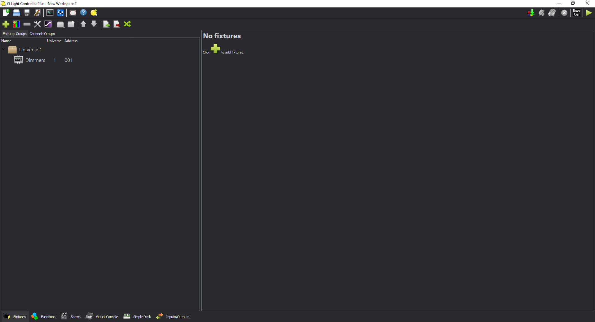
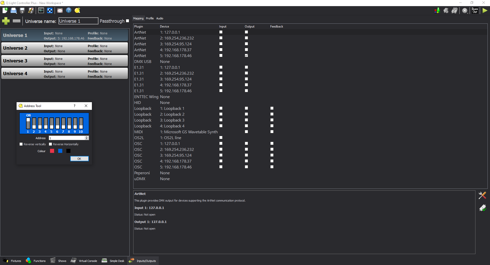

# QLC+ dark theme
## Simple dark theme for QLC+

Forked form [EmerickH/qlcplus-dark-theme](https://github.com/EmerickH/qlcplus-dark-theme)  
Modified by [Xilef12000](https://github.com/Xilef12000)  

See https://www.instructables.com/QLC-Dark-Theme/ for more info.  
See https://www.xilef12000.com/post/qlcplus-dark-theme_10a2/ for more info.  

Copy **qlcplusStyle.qss** to:

- Linux **$HOME/.qlcplus**
- Windows  **C:\Users\YOURUSERNAME\QLC+\qlcplusStyle.qss**
- MacOS **~/Library/Application Support/QLC+/qlcplusStyle.qss**

